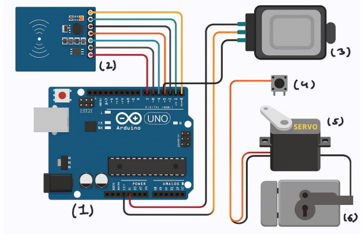

# Smart Lock – Dual Factor Authentication System

**Feb 2025 – March 2025**  
**Technologies:** Arduino, RFID (MFRC522), Fingerprint Sensor, Servo, C++

## Overview

This project implements a **secure access control system** using **dual-factor authentication** (RFID + fingerprint) on Arduino. It leverages an MFRC522 RFID module and an Adafruit fingerprint sensor, ensuring robust and reliable entry control with real-time UID and fingerprint verification.

## Features

- **Dual Factor Authentication**: Requires both RFID card and fingerprint match for entry.
- **Real-Time UID and Fingerprint Matching** using SPI and SoftwareSerial protocols.
- **Servo-Controlled Locking Mechanism** for physical access control.
- **Button-triggered Input Mode Switching** for flexible operation.
- **Fault Handling and Error Notifications** to ensure system robustness.

## Hardware Components

- Arduino Uno / Nano
- MFRC522 RFID Reader
- Adafruit Fingerprint Sensor
- Micro Servo Motor
- Push Button
- Breadboard & Jumper Wires
- External Power Source (recommended)

## Circuit Connections

| Component               | Arduino Pins                    |
|--------------------------|--------------------------------|
| MFRC522 RFID Module      | SPI (MISO, MOSI, SCK, SDA)     |
| Fingerprint Sensor       | SoftwareSerial (TX, RX)        |
| Servo Motor              | PWM Pin (D9 / D10)             |
| Push Button              | Digital Pin + GND              |

> Ensure you use appropriate resistors for button debouncing if necessary.

## Future Improvements

- Integration with IoT for remote monitoring.
- Adding LCD/OLED display for status and instructions.
- Logging access attempts with timestamps to an SD card or server.
- Mobile app integration for admin control and monitoring.

## License

This project is open-source under the MIT License.

---

Feel free to fork, modify, and contribute to enhance this project further!

